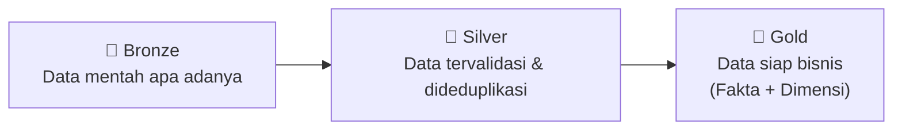
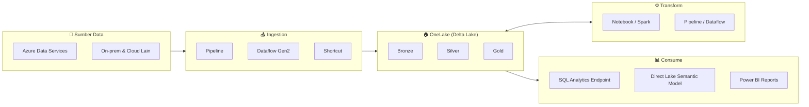
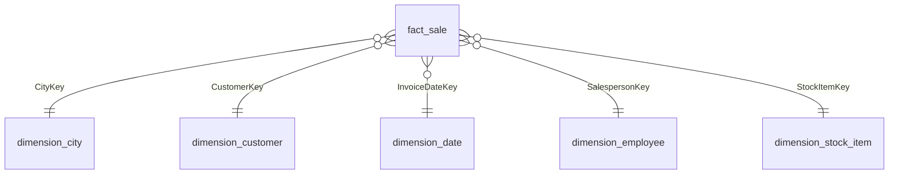
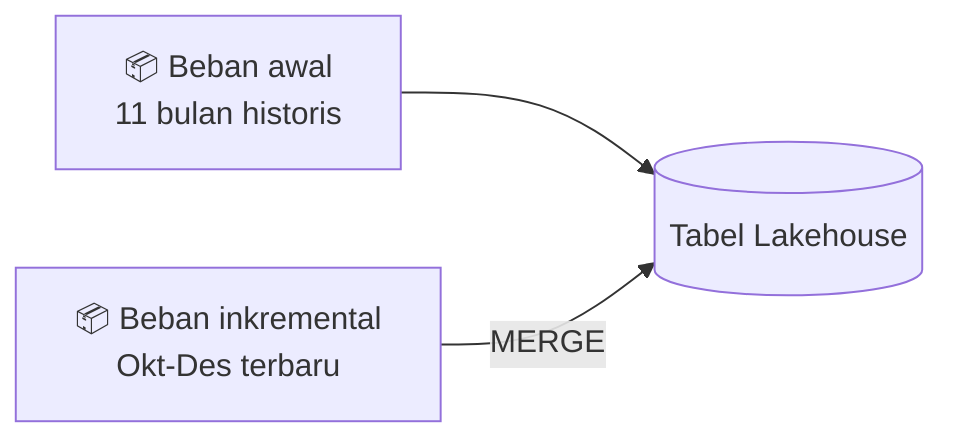

# Skenario Lakehouse end-to-end: ikhtisar dan arsitektur

> 🇬🇧 English version: [1 - Lakehouse tutorial introduction.md](1%20-%20Lakehouse%20tutorial%20introduction.md)

Microsoft Fabric adalah solusi analitik all-in-one untuk perusahaan yang mencakup segala hal mulai dari pergerakan data hingga data science, analitik real-time, dan business intelligence. Fabric menyediakan rangkaian layanan komprehensif, termasuk data lake, data engineering, dan integrasi data, semuanya dalam satu tempat. Untuk informasi selengkapnya, lihat [Apa itu Microsoft Fabric?](https://learn.microsoft.com/id-id/fabric/fundamentals/microsoft-fabric-overview)

Tutorial ini menuntun Anda melalui skenario end-to-end dari akuisisi data hingga konsumsi data. Tutorial ini membantu Anda membangun pemahaman dasar tentang Fabric, termasuk berbagai pengalaman dan bagaimana mereka terintegrasi, serta pengalaman developer profesional dan citizen developer yang hadir saat bekerja di platform ini. Tutorial ini tidak dimaksudkan sebagai arsitektur referensi, daftar lengkap fitur dan fungsi, atau rekomendasi praktik terbaik tertentu.

## Skenario Lakehouse end-to-end

Secara tradisional, organisasi telah membangun modern data warehouse untuk kebutuhan analitik data transaksional dan terstruktur. Dan data lakehouse untuk kebutuhan analitik big data (semi/tidak terstruktur). Kedua sistem ini berjalan secara paralel, menciptakan silo, duplikasi data, dan total cost of ownership (TCO) yang meningkat.

Fabric dengan unifikasi penyimpanan data dan standardisasi pada format Delta Lake memungkinkan Anda menghilangkan silo, menghapus duplikasi data, dan mengurangi TCO secara drastis.

Dengan fleksibilitas yang ditawarkan Fabric, Anda dapat mengimplementasikan arsitektur lakehouse atau data warehouse atau menggabungkan keduanya untuk mendapatkan yang terbaik dari kedua dunia dengan implementasi yang sederhana. Dalam tutorial ini, Anda akan mengambil contoh organisasi ritel dan membangun lakehouse-nya dari awal hingga akhir. Tutorial ini menggunakan [arsitektur medallion](https://learn.microsoft.com/id-id/azure/databricks/lakehouse/medallion) di mana lapisan bronze berisi data mentah, lapisan silver berisi data yang tervalidasi dan dideduplikasi, dan lapisan gold berisi data yang sangat halus. Anda dapat menggunakan pendekatan yang sama untuk mengimplementasikan lakehouse untuk organisasi apa pun di industri apa pun.

Tutorial ini menjelaskan bagaimana seorang developer di perusahaan fiktif Wide World Importers dari domain ritel menyelesaikan langkah-langkah berikut:

1. Masuk ke akun Power BI Anda dan daftar untuk [trial Microsoft Fabric gratis](https://learn.microsoft.com/id-id/fabric/fundamentals/fabric-trial). Jika Anda tidak memiliki lisensi Power BI, [daftar untuk lisensi Fabric gratis](https://app.fabric.microsoft.com/?pbi_source=learn-data-engineering-tutorial-lakehouse-introduction) dan kemudian Anda dapat memulai trial Fabric.
2. Bangun dan implementasikan lakehouse end-to-end untuk organisasi Anda:

    - [Buat workspace Fabric](https://learn.microsoft.com/id-id/fabric/data-engineering/tutorial-lakehouse-get-started).
    - [Buat lakehouse](https://learn.microsoft.com/id-id/fabric/data-engineering/tutorial-build-lakehouse).
    - [Ingest data](https://learn.microsoft.com/id-id/fabric/data-engineering/tutorial-lakehouse-data-ingestion), [transformasi data](https://learn.microsoft.com/id-id/fabric/data-engineering/tutorial-lakehouse-data-preparation), dan muat ke lakehouse. Anda juga dapat mengeksplorasi OneLake, satu salinan data Anda di seluruh mode lakehouse dan mode SQL analytics endpoint.
    - Hubungkan ke lakehouse Anda menggunakan SQL analytics endpoint dan [buat semantic model dan bangun laporan](https://learn.microsoft.com/id-id/fabric/data-engineering/tutorial-lakehouse-build-report) untuk menganalisis data penjualan di berbagai dimensi.
    - Secara opsional, Anda dapat mengorkestrasi dan menjadwalkan alur ingest dan transformasi data dengan pipeline.
3. [Bersihkan resource](https://learn.microsoft.com/id-id/fabric/data-engineering/tutorial-lakehouse-clean-up) dengan menghapus workspace dan item lainnya.

## Arsitektur

Gambar berikut menampilkan arsitektur lakehouse end-to-end. Komponen yang terlibat dijelaskan pada daftar berikut.

- **Sumber data**: Fabric mempermudah dan mempercepat koneksi ke Azure Data Services, serta platform berbasis cloud lainnya dan sumber data on-premises, untuk ingest data yang efisien.
- **Ingestion**: Anda dapat dengan cepat membangun insight untuk organisasi Anda menggunakan lebih dari 200 konektor native. Konektor-konektor ini terintegrasi ke dalam pipeline Fabric dan memanfaatkan transformasi data drag-and-drop yang ramah pengguna dengan dataflow. Selain itu, dengan fitur Shortcut di Fabric Anda dapat terhubung ke data yang ada, tanpa harus menyalin atau memindahkannya.
- **Transform and store**: Fabric menstandardisasi format Delta Lake. Yang berarti semua engine Fabric dapat mengakses dan memanipulasi dataset yang sama yang disimpan di OneLake tanpa duplikasi data. Sistem penyimpanan ini menyediakan fleksibilitas untuk membangun lakehouse menggunakan arsitektur medallion atau data mesh, tergantung kebutuhan organisasi Anda. Anda dapat memilih antara pengalaman low-code atau no-code untuk transformasi data, menggunakan pipeline/dataflow atau notebook/Spark untuk pengalaman code-first.
- **Consume**: Power BI dapat mengonsumsi data dari Lakehouse untuk pelaporan dan visualisasi. Setiap Lakehouse memiliki TDS endpoint built-in yang disebut *SQL analytics endpoint* untuk konektivitas dan kueri data yang mudah di tabel Lakehouse dari alat pelaporan lain. SQL analytics endpoint memberikan pengguna fungsi koneksi SQL.

### Diagram arsitektur (Mermaid)

## Dataset sampel

Tutorial ini menggunakan [database sampel Wide World Importers (WWI)](https://learn.microsoft.com/id-id/sql/samples/wide-world-importers-what-is) yang Anda impor ke lakehouse pada tutorial berikutnya. Untuk skenario lakehouse end-to-end, dataset ini berisi cukup data untuk mengeksplorasi kemampuan skala dan performa platform Fabric.

Wide World Importers (WWI) adalah importir dan distributor grosir barang novelty yang beroperasi dari area San Francisco Bay. Sebagai grosir, pelanggan WWI sebagian besar adalah perusahaan yang menjual kembali ke individu. WWI menjual ke pelanggan ritel di seluruh Amerika Serikat termasuk toko khusus, supermarket, toko komputer, toko atraksi turis, dan beberapa individu. WWI juga menjual ke grosir lain melalui jaringan agen yang mempromosikan produk atas nama WWI.

Secara umum, data dibawa dari sistem transaksional atau aplikasi line-of-business ke dalam lakehouse. Namun, untuk kesederhanaan dalam tutorial ini, Anda menggunakan model dimensional yang disediakan oleh WWI sebagai sumber data awal. Anda meng-ingest data ke dalam lakehouse dan mentransformasinya melalui berbagai tahapan (Bronze, Silver, dan Gold) dari arsitektur medallion.

## Model data

Meskipun model dimensional WWI berisi banyak [tabel fakta](https://learn.microsoft.com/id-id/fabric/data-warehouse/dimensional-modeling-fact-tables), tutorial ini menggunakan tabel fakta *Sale* dan dimensi-dimensi terkait. Contoh berikut mengilustrasikan model data WWI:

## Alur data dan transformasi

Seperti dijelaskan sebelumnya, tutorial ini menggunakan data sampel dari [Wide World Importers (WWI) sample data](https://learn.microsoft.com/id-id/sql/samples/wide-world-importers-what-is) untuk membangun lakehouse end-to-end. Dalam implementasi ini, data sampel disimpan dalam akun Azure Data storage dalam format file Parquet untuk semua tabel. Namun, dalam skenario dunia nyata, data biasanya berasal dari berbagai sumber dan dalam format yang beragam.

Gambar berikut menampilkan sumber, tujuan, dan transformasi data:

- **Sumber Data**: Data sumber dalam format file Parquet dan dalam struktur yang tidak dipartisi. Data disimpan dalam folder untuk setiap tabel. Dalam tutorial ini, Anda menyiapkan pipeline untuk mengingest data historis lengkap atau sekali waktu ke dalam lakehouse.

    Dalam tutorial ini, Anda menggunakan tabel fakta *Sale*, yang memiliki satu folder induk dengan data historis selama 11 bulan (dengan satu subfolder untuk setiap bulan) dan folder lain yang berisi data inkremental selama tiga bulan (satu subfolder untuk setiap bulan). Selama ingest data awal, 11 bulan data diingest ke tabel lakehouse. Ketika data inkremental tiba, data Oktober dan November yang diperbarui digabungkan dengan data yang ada, dan data Desember baru ditulis ke tabel lakehouse seperti yang ditampilkan pada gambar berikut:

    

- **Lakehouse**: Dalam tutorial ini, Anda membuat lakehouse, mengingest data ke bagian Files dari lakehouse, dan kemudian membuat tabel delta lake di bagian Tables dari lakehouse.
- **Transform**: Untuk persiapan dan transformasi data, tutorial ini mencakup dua pendekatan berbeda: notebook dan Spark untuk pengalaman code-first, dan pipeline serta dataflow untuk pengalaman low-code atau no-code.
- **Consume**: Power BI dapat mengonsumsi data dari lakehouse untuk pelaporan dan visualisasi. Setiap lakehouse memiliki TDS endpoint built-in yang disebut *SQL analytics endpoint* untuk konektivitas dan kueri data yang mudah di tabel lakehouse dari alat pelaporan lain. Anda juga dapat menggunakan fitur Direct Lake untuk membuat laporan dan dashboard yang melakukan kueri data langsung dari lakehouse. Selain itu, Anda dapat membuat data Anda tersedia untuk alat pelaporan non-Microsoft dengan menggunakan TDS/SQL analytics endpoint untuk terhubung dan menjalankan kueri SQL untuk analitik.

## Langkah berikutnya

> [Buat workspace Fabric](2%20-%20Memulai.id.md)
