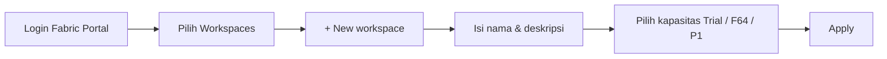

# Tutorial Lakehouse: Membuat workspace Fabric

> 🇬🇧 English version: [2 - Get started.md](2%20-%20Get%20started.md)

Sebelum Anda dapat mulai membuat lakehouse, Anda perlu membuat workspace di mana Anda dapat membangun bagian sisa tutorial.

## Prasyarat

Daftar untuk [trial Microsoft Fabric gratis](https://learn.microsoft.com/id-id/fabric/fundamentals/fabric-trial). Trial Fabric memerlukan lisensi Power BI. Jika Anda tidak memilikinya, [daftar lisensi Fabric gratis](https://app.fabric.microsoft.com/?pbi_source=learn-data-engineering-tutorial-lakehouse-get-started), lalu Anda dapat memulai trial Fabric.

## Alur pembuatan workspace

## Buat workspace

Pada langkah ini, Anda membuat workspace Fabric. Workspace berisi semua item yang dibutuhkan untuk tutorial lakehouse ini, yang mencakup lakehouse, dataflow, pipeline Data Factory, notebook, semantic model Power BI, dan laporan.

1. Masuk ke [portal Microsoft Fabric](https://app.fabric.microsoft.com).
2. Pilih **Workspaces** lalu pilih **+ New workspace**.
3. Isi formulir **Create a workspace** dengan detail berikut:

    - **Name:** Masukkan *Fabric Lakehouse Tutorial*, dan karakter tambahan agar nama unik.
    - **Description**: Masukkan deskripsi opsional untuk workspace Anda.

        

    - **Advanced**: Di bawah **Workspace type**, pilih kapasitas **Fabric Trial**. Anda juga dapat memilih kapasitas **Fabric** dengan SKU F64 atau kapasitas **Power BI Premium** dengan SKU P1 jika Anda memiliki akses. SKU ini memberikan akses ke semua kemampuan Fabric.

        

4. Pilih **Apply** untuk membuat dan membuka workspace.

## Langkah berikutnya

> [Buat lakehouse di Microsoft Fabric](3%20-%20Membangun%20lakehouse.id.md)
