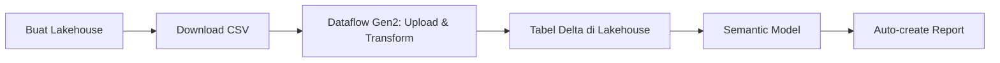

# Tutorial Lakehouse: Membuat lakehouse, mengingest data sampel, dan membangun laporan

> 🇬🇧 English version: [3 - Build a lakehouse.md](3%20-%20Build%20a%20lakehouse.md)

Pada tutorial ini, Anda membangun lakehouse, mengingest data sampel ke dalam tabel Delta, menerapkan transformasi jika diperlukan, lalu membuat laporan.

> [!TIP]
> Tutorial ini bagian dari rangkaian. Setelah menyelesaikannya, lanjut ke [Mengingest data ke lakehouse](4%20-%20Mengingest%20data.id.md) untuk membangun lakehouse enterprise lengkap dengan pipeline Data Factory, notebook Spark, dan teknik pelaporan lanjutan.

Daftar langkah dalam tutorial ini:

- Membuat lakehouse di Microsoft Fabric
- Mengunduh dan mengingest data pelanggan sampel
- Mentransformasi dan memuat data ke lakehouse
- Menambahkan tabel ke semantic model
- Membangun laporan



Jika Anda tidak memiliki Microsoft Fabric, daftar untuk [kapasitas trial gratis](https://learn.microsoft.com/id-id/fabric/fundamentals/fabric-trial).

## Prasyarat

- Sebelum membuat lakehouse, Anda harus [membuat workspace Fabric](2%20-%20Memulai.id.md).
- Sebelum mengingest file CSV, Anda harus mengonfigurasi OneDrive. Jika belum, daftar untuk Microsoft 365 free trial: [Free Trial - Try Microsoft 365 for a month](https://www.microsoft.com/microsoft-365/try). Untuk panduan setup, lihat [Set up OneDrive](https://support.microsoft.com/id-id/office/setup-onedrive-for-microsoft-365-for-business-937e3ac8-b396-4a70-a561-6eaa479a4720).

### Mengapa OneDrive diperlukan untuk tutorial ini?

Anda memerlukan OneDrive untuk tutorial ini karena proses ingest data mengandalkan OneDrive sebagai mekanisme penyimpanan dasar untuk upload file. Saat Anda mengupload file CSV ke Fabric, file disimpan sementara di akun OneDrive Anda sebelum di-ingest ke lakehouse. Integrasi ini memastikan transfer file yang aman dan mulus dalam ekosistem Microsoft 365.

Langkah ingest tidak berfungsi jika Anda tidak mengonfigurasi OneDrive, karena Fabric tidak dapat mengakses file yang diupload. Jika data sudah tersedia di lakehouse Anda atau lokasi lain yang didukung, OneDrive tidak diperlukan.

> [!NOTE]
> Jika Anda sudah memiliki data di lakehouse, Anda dapat menggunakannya alih-alih file CSV sampel. Untuk memeriksa, gunakan Lakehouse Explorer atau SQL analytics endpoint untuk menelusuri tabel, file, dan folder. Lihat [Lakehouse overview](https://learn.microsoft.com/id-id/fabric/data-engineering/lakehouse-overview) dan [Query lakehouse tables with SQL analytics endpoint](https://learn.microsoft.com/id-id/fabric/data-warehouse/get-started-lakehouse-sql-analytics-endpoint).

## Membuat lakehouse

Pada bagian ini, Anda membuat lakehouse di Fabric.

1. Di [Fabric](https://app.fabric.microsoft.com), pilih **Workspaces** dari bilah navigasi.
2. Untuk membuka workspace, masukkan namanya di kotak pencarian di atas dan pilih dari hasil pencarian.
3. Dari workspace, pilih **New item**, masukkan **Lakehouse** di kotak pencarian, lalu pilih **Lakehouse**.
4. Pada dialog **New lakehouse**, masukkan **wwilakehouse** di kolom **Name**.

    [](https://learn.microsoft.com/id-id/fabric/data-engineering/media/tutorial-build-lakehouse/new-lakehouse-name.png#lightbox)

5. Pilih **Create** untuk membuat dan membuka lakehouse baru.

## Mengingest data sampel

Pada bagian ini, Anda mengingest data pelanggan sampel ke lakehouse.

> [!NOTE]
> Jika Anda belum mengonfigurasi OneDrive, daftar Microsoft 365 free trial: [Free Trial - Try Microsoft 365 for a month](https://www.microsoft.com/microsoft-365/try).

1. Unduh file *dimension_customer.csv* dari [Fabric samples repo](https://github.com/microsoft/fabric-samples/blob/main/docs-samples/data-engineering/dimension_customer.csv).
2. Pilih Lakehouse Anda dan buka tab **Home**.
3. Pilih **Get data** > **New Dataflow Gen2** untuk membuat dataflow baru. Anda menggunakan dataflow ini untuk mengingest data sampel ke lakehouse. Sebagai alternatif, di bawah **Get data in your lakehouse**, Anda dapat memilih tile **New Dataflow Gen2**.

    [](https://learn.microsoft.com/id-id/fabric/data-engineering/media/tutorial-build-lakehouse/load-data-lakehouse-option.png#lightbox)

4. Di pane **New Dataflow Gen2**, masukkan **Customer Dimension Data** di kolom **Name** dan pilih **Create**.

    [](https://learn.microsoft.com/id-id/fabric/data-engineering/media/tutorial-build-lakehouse/create-dataflow-name.png#lightbox)

5. Pada tab **Home** dataflow, pilih tile **Import from a Text/CSV file**.
6. Pada layar **Connect to data source**, pilih radio button **Upload file**.
7. Telusuri atau drag-and-drop file *dimension_customer.csv* yang Anda unduh pada langkah 1. Setelah file diupload, pilih **Next**.

    [](https://learn.microsoft.com/id-id/fabric/data-engineering/media/tutorial-build-lakehouse/connection-settings-upload.png#lightbox)

8. Pada halaman **Preview file data** Anda dapat melihat preview data. Lalu pilih **Create** untuk melanjutkan dan kembali ke kanvas dataflow.

## Mentransformasi dan memuat data ke lakehouse

Pada bagian ini, Anda mentransformasi data berdasarkan kebutuhan bisnis Anda dan memuatnya ke lakehouse.

1. Di pane **Query settings**, pastikan kolom **Name** disetel ke **dimension_customer**. Nama ini digunakan sebagai nama tabel di lakehouse, jadi harus huruf kecil dan tidak boleh berisi spasi.

    [](https://learn.microsoft.com/id-id/fabric/data-engineering/media/tutorial-build-lakehouse/query-settings-add-destination.png#lightbox)

2. Karena Anda membuat dataflow dari lakehouse, tujuan data otomatis disetel ke lakehouse Anda. Anda dapat memverifikasinya dengan memeriksa **Data destination** di pane query settings.

    > [!TIP]
    > Jika Anda membuat dataflow dari workspace alih-alih dari lakehouse, Anda perlu menambahkan tujuan data secara manual. Lihat [Dataflow Gen2 default destination](https://learn.microsoft.com/id-id/fabric/data-factory/default-destination) dan [Data destinations and managed settings](https://learn.microsoft.com/id-id/fabric/data-factory/dataflow-gen2-data-destinations-and-managed-settings).

3. Dari kanvas dataflow, Anda dapat dengan mudah mentransformasi data berdasarkan kebutuhan bisnis Anda. Untuk kesederhanaan, kita tidak melakukan perubahan dalam tutorial ini. Untuk melanjutkan, pilih **Save and Run** di toolbar.

    [](https://learn.microsoft.com/id-id/fabric/data-engineering/media/tutorial-build-lakehouse/query-settings-publish.png#lightbox)

    Tunggu hingga dataflow selesai berjalan. Selama proses, Anda akan melihat indikator status berputar.

    [](https://learn.microsoft.com/id-id/fabric/data-engineering/media/tutorial-build-lakehouse/dataflow-running.png#lightbox)

4. Setelah dataflow selesai berhasil, pilih lakehouse Anda di menu bar atas untuk membukanya.
5. Di lakehouse explorer, temukan skema **dbo** di bawah **Tables**, pilih menu **...** (titik tiga) di sebelahnya, lalu pilih **Refresh**. Ini menjalankan dataflow dan memuat data dari file sumber ke tabel lakehouse.

    [](https://learn.microsoft.com/id-id/fabric/data-engineering/media/tutorial-build-lakehouse/dataflow-refresh-now.png#lightbox)

6. Setelah refresh selesai, perluas skema **dbo** untuk melihat tabel Delta **dimension_customer**. Pilih tabel untuk melihat preview data.
7. Anda dapat menggunakan SQL analytics endpoint dari lakehouse untuk melakukan kueri data dengan pernyataan SQL. Pilih **SQL analytics endpoint** dari dropdown menu di kanan atas layar.

    [](https://learn.microsoft.com/id-id/fabric/data-engineering/media/tutorial-build-lakehouse/lakehouse-delta-table.png#lightbox)

8. Pilih tabel **dimension_customer** untuk melihat preview data. Untuk menulis pernyataan SQL, pilih **New SQL Query** dari menu atau pilih tile **New SQL Query**.

    [](https://learn.microsoft.com/id-id/fabric/data-engineering/media/tutorial-build-lakehouse/warehouse-mode-new-sql.png#lightbox)

9. Masukkan kueri sampel berikut yang menggregasi jumlah baris berdasarkan kolom *BuyingGroup* dari tabel *dimension_customer*.

    ```sql
    SELECT BuyingGroup, Count(*) AS Total
    FROM dimension_customer
    GROUP BY BuyingGroup
    ```

    > [!NOTE]
    > File kueri SQL disimpan otomatis untuk referensi masa depan, dan Anda dapat me-rename atau menghapus file ini sesuai kebutuhan.

10. Untuk menjalankan skrip, pilih ikon **Run** di bagian atas file skrip.

    [](https://learn.microsoft.com/id-id/fabric/data-engineering/media/tutorial-build-lakehouse/warehouse-mode-sql-run-result.png#lightbox)

## Menambahkan tabel ke semantic model

Pada bagian ini, Anda menambahkan tabel ke semantic model agar dapat digunakan untuk membuat laporan.

1. Buka lakehouse Anda dan beralih ke tampilan **SQL analytics endpoint**.
2. Pilih **New semantic model**.
3. Di pane **New semantic model**, masukkan nama untuk semantic model, tetapkan workspace, dan pilih tabel yang ingin ditambahkan. Dalam kasus ini, pilih tabel **dimension_customer**.

    [](https://learn.microsoft.com/id-id/fabric/data-engineering/media/tutorial-build-lakehouse/select-semantic-model-tables.png#lightbox)

4. Pilih **Confirm** untuk membuat semantic model.

    > [!WARNING]
    > Jika muncul pesan error "We couldn't add or remove tables" karena kapasitas Fabric organisasi melebihi limit, tunggu beberapa menit lalu coba lagi. Lihat [Fabric capacity documentation](https://learn.microsoft.com/id-id/fabric/enterprise/scale-capacity).

5. Semantic model dibuat dalam mode penyimpanan Direct Lake, yang berarti membaca data langsung dari tabel Delta di OneLake untuk performa kueri cepat tanpa perlu mengimpor data. Setelah dibuat, Anda dapat mengedit semantic model untuk menambahkan relasi, measure, dan lainnya.

    > [!TIP]
    > Pelajari lebih lanjut tentang Direct Lake di [Direct Lake overview](https://learn.microsoft.com/id-id/fabric/fundamentals/direct-lake-overview).

## Membangun laporan

Pada bagian ini, Anda membangun laporan dari semantic model yang dibuat.

1. Di workspace, temukan semantic model, pilih menu **...** (titik tiga), lalu pilih **Auto-create report**.

    [](https://learn.microsoft.com/id-id/fabric/data-engineering/media/tutorial-build-lakehouse/dataset-details-create-report.png#lightbox)

2. Tabel ini adalah dimensi dan tidak ada measure di dalamnya. Power BI membuat measure untuk jumlah baris, mengagregasinya di berbagai kolom, dan membuat berbagai chart.

    [](https://learn.microsoft.com/id-id/fabric/data-engineering/media/tutorial-build-lakehouse/quick-summary-report.png#lightbox)

3. Anda dapat menyimpan laporan ini untuk masa depan dengan memilih **Save** di ribbon atas. Anda dapat melakukan perubahan lebih lanjut sesuai kebutuhan dengan menyertakan/mengecualikan tabel atau kolom lain.

## Langkah berikutnya

> [Mengingest data ke lakehouse](4%20-%20Mengingest%20data.id.md)
