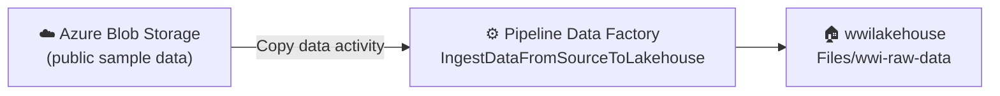

# Tutorial Lakehouse: Mengingest data ke lakehouse

> 🇬🇧 English version: [4 - Ingest data.md](4%20-%20Ingest%20data.md)

Pada tutorial ini, Anda mengingest lebih banyak tabel dimensional dan [tabel fakta](https://learn.microsoft.com/id-id/fabric/data-warehouse/dimensional-modeling-fact-tables) dari Wide World Importers (WWI) ke lakehouse. Pipeline memungkinkan Anda mengingest data dalam skala besar dengan opsi untuk menjadwalkan workflow data.

## Prasyarat

- Jika Anda belum memiliki lakehouse, Anda harus [membuat lakehouse](3%20-%20Membangun%20lakehouse.id.md).

## Diagram alur pipeline ingest



## Mengingest data

Pada bagian ini, Anda menggunakan **aktivitas Copy data** dari pipeline Data Factory untuk mengingest data sampel dari akun Azure storage ke bagian **Files** dari [lakehouse yang Anda buat pada tutorial sebelumnya](3%20-%20Membangun%20lakehouse.id.md).

1. Di workspace yang Anda buat pada tutorial sebelumnya, pilih **New item**.
2. Cari **Pipeline** di kotak pencarian dan pilih tile **Pipeline**.
3. Pada dialog **New pipeline**, isi nama dengan **IngestDataFromSourceToLakehouse** dan pilih **Create**.
4. Dari tab **Home** pipeline baru, pilih **Pipeline activity** > **Copy data**.

    [](https://learn.microsoft.com/id-id/fabric/data-engineering/media/tutorial-lakehouse-data-ingestion/pipeline-copy-data.png#lightbox)

5. Pilih aktivitas **Copy data** baru dari kanvas. Properti aktivitas muncul di pane bawah kanvas, terorganisir di tab **General**, **Source**, **Destination**, **Mapping**, dan **Settings**. Anda mungkin perlu memperluas pane ke atas dengan menarik tepi atas.
6. Pada tab **General**, masukkan **Data Copy to Lakehouse** di kolom **Name**. Biarkan kolom lain dengan nilai default.

    [](https://learn.microsoft.com/id-id/fabric/data-engineering/media/tutorial-lakehouse-data-ingestion/data-copy-to-lakehouse.png#lightbox)

7. Pada tab **Source**, pilih dropdown **Connection** lalu pilih **Browse all**.
8. Pada halaman **Choose a data source to get started**, cari dan pilih **Azure blobs**.
9. Masukkan detail berikut pada halaman **Connect data source**. Lalu pilih **Connect** untuk membuat koneksi ke sumber data. Untuk tutorial ini, semua data sampel tersedia di kontainer publik Azure blob storage. Anda terhubung ke kontainer ini untuk menyalin data darinya.

    | Properti | Nilai |
    | --- | --- |
    | Account name or URL | `https://fabrictutorialdata.blob.core.windows.net/sampledata/` |
    | Connection | Create new connection |
    | Connection name | wwisampledata |
    | Authentication kind | Anonymous |

    [](https://learn.microsoft.com/id-id/fabric/data-engineering/media/tutorial-lakehouse-data-ingestion/data-store-source-blob.png#lightbox)

10. Pada tab **Source**, koneksi yang baru dibuat dipilih secara default. Tentukan properti berikut sebelum berpindah ke pengaturan tujuan.

    | Properti | Nilai |
    | --- | --- |
    | Connection | wwisampledata |
    | File path type | File path |
    | File path | Container name (kotak teks pertama): sampledata  Directory name (kotak teks kedua): WideWorldImportersDW/parquet |
    | Recursively | Checked |
    | File format | Binary |

    [](https://learn.microsoft.com/id-id/fabric/data-engineering/media/tutorial-lakehouse-data-ingestion/blob-storage-connection-settings.png#lightbox)

11. Pada tab **Destination**, tentukan properti berikut:

    | Properti | Nilai |
    | --- | --- |
    | Connection | wwilakehouse (pilih lakehouse Anda jika namanya berbeda) |
    | Root folder | Files |
    | File path | Directory name (kotak teks pertama): wwi-raw-data |
    | File format | Binary |

    [](https://learn.microsoft.com/id-id/fabric/data-engineering/media/tutorial-lakehouse-data-ingestion/destination-settings.png#lightbox)

12. Anda telah mengonfigurasi aktivitas copy data. Pilih ikon **Save** di ribbon atas (di bawah Home) untuk menyimpan perubahan, dan pilih **Run** untuk mengeksekusi pipeline dan aktivitasnya. Anda juga dapat menjadwalkan pipeline untuk me-refresh data pada interval yang ditentukan sesuai kebutuhan bisnis. Untuk tutorial ini, kita menjalankan pipeline hanya sekali dengan memilih **Run**.
13. Aksi ini memicu copy data dari sumber data ke lakehouse yang ditentukan dan mungkin memakan waktu hingga satu menit. Anda dapat memantau eksekusi pipeline dan aktivitasnya di tab **Output**. Status aktivitas berubah dari **Queued** > **In progress** > **Succeeded**.

    ```mermaid
    stateDiagram-v2
        [*] --> Queued
        Queued --> InProgress: Run dipicu
        InProgress --> Succeeded: Copy selesai
        InProgress --> Failed: Terjadi error
        Succeeded --> [*]
        Failed --> [*]
    ```

    [](https://learn.microsoft.com/id-id/fabric/data-engineering/media/tutorial-lakehouse-data-ingestion/save-run-output-tab.png#lightbox)

    > [!TIP]
    > Pilih **View Run details** untuk melihat informasi lebih lanjut tentang run.

14. Setelah copy activity berhasil, buka lakehouse Anda (wwilakehouse) untuk melihat data. Refresh bagian **Files** untuk melihat data yang diingest. Folder baru **wwi-raw-data** muncul di bagian files, dan data dari tabel Azure Blob disalin ke sana.

    [](https://learn.microsoft.com/id-id/fabric/data-engineering/media/tutorial-lakehouse-data-ingestion/validate-data-lakehouse.png#lightbox)

Untuk memuat data inkremental ke lakehouse, lihat [Incrementally load data from a data warehouse to a lakehouse](https://learn.microsoft.com/id-id/fabric/data-factory/tutorial-incremental-copy-data-warehouse-lakehouse).

## Langkah berikutnya

> [Menyiapkan dan mentransformasi data](5%20-%20Menyiapkan%20data.id.md)
