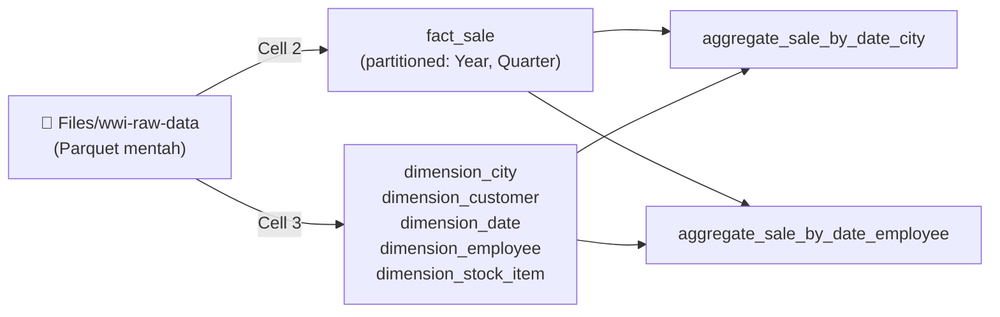

# Tutorial Lakehouse: Menyiapkan dan mentransformasi data di lakehouse

> 🇬🇧 English version: [5 - Prepare data.md](5%20-%20Prepare%20data.md)

Pada tutorial ini, Anda menggunakan notebook dengan [Spark runtime](https://learn.microsoft.com/id-id/fabric/data-engineering/runtime) untuk mentransformasi dan menyiapkan data mentah di lakehouse Anda.

## Prasyarat

Sebelum memulai, Anda harus menyelesaikan tutorial sebelumnya:

1. [Membuat lakehouse](3%20-%20Membangun%20lakehouse.id.md)
2. [Mengingest data ke lakehouse](4%20-%20Mengingest%20data.id.md)
3. Pastikan [lakehouse schemas](https://learn.microsoft.com/id-id/fabric/data-engineering/lakehouse-schemas) diaktifkan di lakehouse Anda.

## Alur transformasi



## Menyiapkan data

Dari langkah-langkah tutorial sebelumnya, Anda telah memiliki data mentah yang diingest dari sumber ke bagian **Files** dari lakehouse. Sekarang Anda dapat mentransformasi data tersebut dan menyiapkannya untuk membuat tabel Delta.

1. Unduh notebook dari folder [Lakehouse Tutorial Source Code](https://github.com/microsoft/fabric-samples/tree/main/docs-samples/data-engineering/Lakehouse%20Tutorial%20Source%20Code).
2. Di browser, buka workspace Fabric Anda di [Fabric portal](https://app.fabric.microsoft.com/).
3. Pilih **Import** > **Notebook** > **From this computer**.

    [](https://learn.microsoft.com/id-id/fabric/data-engineering/media/tutorial-lakehouse-data-preparation/import-notebook.png#lightbox)

4. Pilih **Upload** dari pane **Import status** yang terbuka di sisi kanan layar.
5. Pilih hanya notebook yang sesuai dengan bahasa pemrograman pilihan Anda.

    - **PySpark** (`Prepare and transform data - PySpark.ipynb`)
    - **Spark SQL** (`Prepare and transform data - Spark SQL.ipynb`)

6. Pilih **Open**. Notifikasi yang menunjukkan status import muncul di sudut kanan atas jendela browser.
7. Setelah import berhasil, pergi ke tampilan items workspace untuk memverifikasi notebook yang diimpor.

    [](https://learn.microsoft.com/id-id/fabric/data-engineering/media/tutorial-lakehouse-data-preparation/imported-notebooks-lakehouse.png#lightbox)

8. Pilih lakehouse **wwilakehouse** untuk membukanya, sehingga notebook yang Anda buka selanjutnya tertaut ke lakehouse tersebut.
9. Dari menu navigasi atas, pilih **Open notebook** > **Existing notebook**.

    [](https://learn.microsoft.com/id-id/fabric/data-engineering/media/tutorial-lakehouse-data-preparation/existing-notebook-ribbon.png#lightbox)

10. Pilih notebook yang Anda impor untuk PySpark atau Spark SQL dan pilih **Open**. Notebook sudah tertaut ke lakehouse yang dibuka.

Anda sekarang siap menjalankan cell notebook yang membuat dan mentransformasi tabel Delta.

> [!IMPORTANT]
> Tutorial ini memerlukan lakehouse schemas diaktifkan. Jika tidak, kode tutorial ini tidak berfungsi sebagaimana mestinya.

Pada notebook yang diimpor, Anda akan melihat bagian **Path 1** dan **Path 2**. Untuk tutorial ini, gunakan **Path 1** (lakehouse schemas diaktifkan) dan abaikan **Path 2**.

## Membuat tabel Delta

Pada bagian ini, Anda menjalankan cell notebook untuk membuat tabel Delta dari data mentah.

Tabel mengikuti star schema, yaitu pola umum untuk mengorganisir data analitik:

- Sebuah **tabel fakta** (`fact_sale`) berisi peristiwa bisnis terukur — dalam hal ini, transaksi penjualan individual dengan kuantitas, harga, dan profit.
- **Tabel dimensi** (`dimension_city`, `dimension_customer`, `dimension_date`, `dimension_employee`, `dimension_stock_item`) berisi atribut deskriptif yang memberi konteks pada fakta — seperti di mana penjualan terjadi, siapa yang melakukan, dan kapan.

Pada halaman tutorial ini, pilih tab yang sesuai dengan notebook yang diimpor, dan tetap gunakan tab yang sama untuk semua langkah. Tab berada di artikel ini, bukan di notebook.

1. **Cell 1 - Konfigurasi sesi Spark.** Cell ini mengaktifkan dua fitur Fabric yang mengoptimalkan cara data ditulis dan dibaca pada cell berikutnya. [V-order](https://learn.microsoft.com/id-id/fabric/data-engineering/delta-optimization-and-v-order) mengoptimalkan layout file parquet untuk pembacaan lebih cepat dan kompresi yang lebih baik. [Optimize write](https://learn.microsoft.com/id-id/fabric/data-engineering/delta-optimization-and-v-order#what-is-optimize-write) mengurangi jumlah file yang ditulis dan menambah ukuran file individual.

    Jalankan cell ini dan tunggu hingga selesai sebelum melanjutkan.

    **PySpark**

    ```python
    spark.conf.set("spark.sql.parquet.vorder.enabled", "true")
    spark.conf.set("spark.microsoft.delta.optimizeWrite.enabled", "true")
    spark.conf.set("spark.microsoft.delta.optimizeWrite.binSize", "1073741824")
    ```

    **Spark SQL**

    ```sql
    %%sql
    SET spark.sql.parquet.vorder.enabled=true;
    SET spark.microsoft.delta.optimizeWrite.enabled=true;
    SET spark.microsoft.delta.optimizeWrite.binSize=1073741824;
    ```

    > [!TIP]
    > Anda tidak perlu menentukan detail Spark pool atau cluster. Fabric menyediakan Spark pool default bernama Live Pool untuk setiap workspace. Saat Anda mengeksekusi cell pertama, live pool dimulai dalam beberapa detik dan membangun sesi Spark. Cell berikutnya berjalan hampir seketika selama sesi aktif.

2. **Cell 2 - Fact - Sale.** Cell ini membaca data parquet mentah dari `Files/wwi-raw-data/full/fact_sale_1y_full`, menambahkan kolom bagian tanggal (**Year**, **Quarter**, dan **Month**), dan menulis `fact_sale` sebagai tabel Delta yang dipartisi berdasarkan **Year** dan **Quarter**.

    Jalankan cell ini dan tunggu hingga selesai sebelum melanjutkan.

    **PySpark**

    ```python
    from pyspark.sql.functions import col, year, month, quarter

    table_name = 'fact_sale'

    df = spark.read.format("parquet").load('Files/wwi-raw-data/full/fact_sale_1y_full')
    df = df.withColumn('Year', year(col("InvoiceDateKey")))
    df = df.withColumn('Quarter', quarter(col("InvoiceDateKey")))
    df = df.withColumn('Month', month(col("InvoiceDateKey")))

    df.write.mode("overwrite").format("delta").partitionBy("Year","Quarter").save("Tables/dbo/" + table_name)
    ```

    **Spark SQL**

    ```sql
    %%sql
    CREATE OR REPLACE TABLE delta.`Tables/dbo/fact_sale`
    USING DELTA
    PARTITIONED BY (Year, Quarter)
    AS
    SELECT
       *,
       year(InvoiceDateKey) AS Year,
       quarter(InvoiceDateKey) AS Quarter,
       month(InvoiceDateKey) AS Month
    FROM parquet.`Files/wwi-raw-data/full/fact_sale_1y_full`;
    ```

3. **Cell 3 - Dimensi.** Cell ini membaca lima dataset parquet dimensi dan menulisnya sebagai tabel Delta (`dimension_city`, `dimension_customer`, `dimension_date`, `dimension_employee`, dan `dimension_stock_item`) di bawah `Tables/dbo/...`.

    Jalankan cell ini dan tunggu hingga selesai sebelum melanjutkan.

    **PySpark**

    ```python
    def loadFullDataFromSource(table_name):
       df = spark.read.format("parquet").load('Files/wwi-raw-data/full/' + table_name)
       df = df.drop("Photo")
       df.write.mode("overwrite").format("delta").save("Tables/dbo/" + table_name)

    full_tables = [
       'dimension_city',
       'dimension_customer',
       'dimension_date',
       'dimension_employee',
       'dimension_stock_item'
    ]

    for table in full_tables:
       loadFullDataFromSource(table)
    ```

    **Spark SQL**

    ```sql
    %%sql
    CREATE OR REPLACE TABLE delta.`Tables/dbo/dimension_city` USING DELTA AS SELECT * FROM parquet.`Files/wwi-raw-data/full/dimension_city`;
    CREATE OR REPLACE TABLE delta.`Tables/dbo/dimension_customer` USING DELTA AS SELECT * FROM parquet.`Files/wwi-raw-data/full/dimension_customer`;
    CREATE OR REPLACE TABLE delta.`Tables/dbo/dimension_date` USING DELTA AS SELECT * FROM parquet.`Files/wwi-raw-data/full/dimension_date`;
    CREATE OR REPLACE TABLE delta.`Tables/dbo/dimension_employee` USING DELTA AS SELECT * FROM parquet.`Files/wwi-raw-data/full/dimension_employee`;
    CREATE OR REPLACE TABLE delta.`Tables/dbo/dimension_stock_item` USING DELTA AS SELECT * FROM parquet.`Files/wwi-raw-data/full/dimension_stock_item`;
    ```

4. Untuk memvalidasi tabel yang dibuat, klik kanan lakehouse **wwilakehouse** di explorer lalu pilih **Refresh**. Tabel akan muncul.

    [](https://learn.microsoft.com/id-id/fabric/data-engineering/media/tutorial-lakehouse-data-preparation/tutorial-lakehouse-explorer-tables.png#lightbox)

## Mentransformasi data untuk agregat bisnis

Pada bagian ini, Anda lanjutkan di notebook yang sama dan menjalankan cell berikutnya untuk membuat tabel agregat dari tabel Delta yang dibuat sebelumnya.

1. Pastikan notebook masih tertaut ke **wwilakehouse**.
2. **Cell 4 - Memuat tabel sumber untuk transformasi (PySpark saja).** Jika Anda menggunakan notebook PySpark, jalankan cell ini untuk memuat tabel Delta ke DataFrame untuk langkah agregasi berikutnya.

    Jalankan cell ini dan tunggu hingga selesai sebelum melanjutkan.

    **PySpark**

    ```python
    df_fact_sale = spark.read.format("delta").load("Tables/dbo/fact_sale")
    df_dimension_date = spark.read.format("delta").load("Tables/dbo/dimension_date")
    df_dimension_city = spark.read.format("delta").load("Tables/dbo/dimension_city")
    ```

    **Spark SQL**

    Tidak ada aksi diperlukan untuk Spark SQL pada langkah ini.

3. **Cell 5 - Membuat `aggregate_sale_by_date_city`.** Cell ini menggabungkan data sales, date, dan city, lalu membuat tabel agregat tingkat kota.

    Jalankan cell ini dan tunggu hingga selesai sebelum melanjutkan.

    **PySpark**

    ```python
    sale_by_date_city = (
       df_fact_sale.alias("sale")
       .join(df_dimension_date.alias("date"), df_fact_sale.InvoiceDateKey == df_dimension_date.Date, "inner")
       .join(df_dimension_city.alias("city"), df_fact_sale.CityKey == df_dimension_city.CityKey, "inner")
       .select("date.Date", "date.CalendarMonthLabel", "date.Day", "date.ShortMonth", "date.CalendarYear", "city.City", "city.StateProvince", "city.SalesTerritory", "sale.TotalExcludingTax", "sale.TaxAmount", "sale.TotalIncludingTax", "sale.Profit")
       .groupBy("date.Date", "date.CalendarMonthLabel", "date.Day", "date.ShortMonth", "date.CalendarYear", "city.City", "city.StateProvince", "city.SalesTerritory")
       .sum("sale.TotalExcludingTax", "sale.TaxAmount", "sale.TotalIncludingTax", "sale.Profit")
       .withColumnRenamed("sum(TotalExcludingTax)", "SumOfTotalExcludingTax")
       .withColumnRenamed("sum(TaxAmount)", "SumOfTaxAmount")
       .withColumnRenamed("sum(TotalIncludingTax)", "SumOfTotalIncludingTax")
       .withColumnRenamed("sum(Profit)", "SumOfProfit")
       .orderBy("date.Date", "city.StateProvince", "city.City")
    )

    sale_by_date_city.write.mode("overwrite").format("delta").option("overwriteSchema", "true").save("Tables/dbo/aggregate_sale_by_date_city")
    ```

    **Spark SQL**

    ```sql
    %%sql
    CREATE OR REPLACE TEMPORARY VIEW sale_by_date_city
    AS
    SELECT
          DD.Date, DD.CalendarMonthLabel
          , DD.Day, DD.ShortMonth Month, CalendarYear Year
          , DC.City, DC.StateProvince, DC.SalesTerritory
          , SUM(FS.TotalExcludingTax) SumOfTotalExcludingTax
          , SUM(FS.TaxAmount) SumOfTaxAmount
          , SUM(FS.TotalIncludingTax) SumOfTotalIncludingTax
          , SUM(FS.Profit) SumOfProfit
    FROM delta.`Tables/dbo/fact_sale` FS
    INNER JOIN delta.`Tables/dbo/dimension_date` DD ON FS.InvoiceDateKey = DD.Date
    INNER JOIN delta.`Tables/dbo/dimension_city` DC ON FS.CityKey = DC.CityKey
    GROUP BY DD.Date, DD.CalendarMonthLabel, DD.Day, DD.ShortMonth, DD.CalendarYear, DC.City, DC.StateProvince, DC.SalesTerritory
    ORDER BY DD.Date ASC, DC.StateProvince ASC, DC.City ASC;

    CREATE OR REPLACE TABLE delta.`Tables/dbo/aggregate_sale_by_date_city`
    AS
    SELECT * FROM sale_by_date_city;
    ```

4. **Cell 6 - Membuat `aggregate_sale_by_date_employee`.** Cell ini menggabungkan data sales, date, dan employee, lalu membuat tabel agregat tingkat karyawan.

    Jalankan cell ini dan tunggu hingga selesai sebelum melanjutkan.

    **PySpark**

    ```python
    spark.sql("""
    CREATE OR REPLACE TEMPORARY VIEW sale_by_date_employee
    AS
    SELECT
               DD.Date, DD.CalendarMonthLabel
            , DD.Day, DD.ShortMonth Month, CalendarYear Year
            , DE.PreferredName, DE.Employee
            , SUM(FS.TotalExcludingTax) SumOfTotalExcludingTax
            , SUM(FS.TaxAmount) SumOfTaxAmount
            , SUM(FS.TotalIncludingTax) SumOfTotalIncludingTax
            , SUM(FS.Profit) SumOfProfit
    FROM delta.`Tables/dbo/fact_sale` FS
    INNER JOIN delta.`Tables/dbo/dimension_date` DD ON FS.InvoiceDateKey = DD.Date
    INNER JOIN delta.`Tables/dbo/dimension_employee` DE ON FS.SalespersonKey = DE.EmployeeKey
    GROUP BY DD.Date, DD.CalendarMonthLabel, DD.Day, DD.ShortMonth, DD.CalendarYear, DE.PreferredName, DE.Employee
    ORDER BY DD.Date ASC, DE.PreferredName ASC, DE.Employee ASC
    """)

    sale_by_date_employee = spark.sql("SELECT * FROM sale_by_date_employee")
    sale_by_date_employee.write.mode("overwrite").format("delta").option("overwriteSchema", "true").save("Tables/dbo/aggregate_sale_by_date_employee")
    ```

    **Spark SQL**

    ```sql
    %%sql
    CREATE OR REPLACE TEMPORARY VIEW sale_by_date_employee
    AS
    SELECT
               DD.Date, DD.CalendarMonthLabel
            , DD.Day, DD.ShortMonth Month, CalendarYear Year
            , DE.PreferredName, DE.Employee
            , SUM(FS.TotalExcludingTax) SumOfTotalExcludingTax
            , SUM(FS.TaxAmount) SumOfTaxAmount
            , SUM(FS.TotalIncludingTax) SumOfTotalIncludingTax
            , SUM(FS.Profit) SumOfProfit
    FROM delta.`Tables/dbo/fact_sale` FS
    INNER JOIN delta.`Tables/dbo/dimension_date` DD ON FS.InvoiceDateKey = DD.Date
    INNER JOIN delta.`Tables/dbo/dimension_employee` DE ON FS.SalespersonKey = DE.EmployeeKey
    GROUP BY DD.Date, DD.CalendarMonthLabel, DD.Day, DD.ShortMonth, DD.CalendarYear, DE.PreferredName, DE.Employee
    ORDER BY DD.Date ASC, DE.PreferredName ASC, DE.Employee ASC;

    CREATE OR REPLACE TABLE delta.`Tables/dbo/aggregate_sale_by_date_employee`
    AS
    SELECT * FROM sale_by_date_employee;
    ```

5. Untuk memvalidasi tabel yang dibuat, klik kanan lakehouse **wwilakehouse** di explorer lalu pilih **Refresh**. Tabel agregat muncul.

    [](https://learn.microsoft.com/id-id/fabric/data-engineering/media/tutorial-lakehouse-data-preparation/validate-tables.png#lightbox)

Tutorial ini menulis data sebagai file Delta lake. Fabric otomatis menemukan dan mendaftarkan tabel ini di metastore, jadi Anda tidak perlu menjalankan pernyataan `CREATE TABLE` terpisah.

## Langkah berikutnya

> [Membuat semantic model dan membangun laporan](6%20-%20Membuat%20semantic%20model%20dan%20laporan.id.md)
