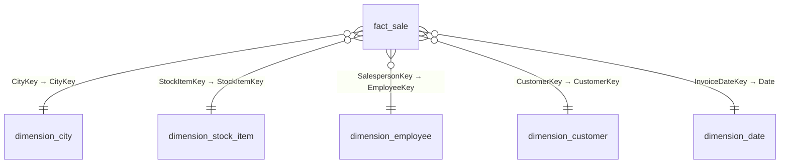
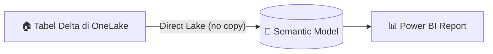

# Tutorial Lakehouse: Membuat semantic model dan membangun laporan

> 🇬🇧 English version: [6 - Create a semantic model and build a report.md](6%20-%20Create%20a%20semantic%20model%20and%20build%20a%20report.md)

Pada bagian tutorial ini, Anda membuat semantic model dari data lakehouse Anda dan mendefinisikan relasi antara tabel fakta dan dimensi. Dengan model data yang siap, Anda dapat membangun laporan Power BI.

## Prasyarat

Sebelum memulai, Anda harus menyelesaikan tutorial sebelumnya:

1. [Membuat workspace](2%20-%20Memulai.id.md)
2. [Membuat lakehouse](3%20-%20Membangun%20lakehouse.id.md)
3. [Mengingest data ke lakehouse](4%20-%20Mengingest%20data.id.md)
4. [Menyiapkan dan mentransformasi data](5%20-%20Menyiapkan%20data.id.md)

## Diagram relasi star schema

Setelah relasi diatur, model data Anda akan terlihat seperti berikut:



## Membuat semantic model

Power BI terintegrasi secara native di Fabric. Saat Anda membuat semantic model dari lakehouse, semantic model menggunakan mode [Direct Lake](https://learn.microsoft.com/id-id/fabric/fundamentals/direct-lake-overview), yang memuat data langsung dari OneLake ke memori untuk analisis cepat tanpa mengimpor atau menduplikasi data.



1. Di browser, buka workspace Fabric Anda di [Fabric portal](https://app.fabric.microsoft.com/).
2. Pilih lakehouse **wwilakehouse** untuk membukanya.
3. Pilih **SQL analytics endpoint** dari dropdown **Lakehouse** di kanan atas layar.

    [](https://learn.microsoft.com/id-id/fabric/data-engineering/media/tutorial-lakehouse-build-report/load-data-choose-sql-endpoint.png#lightbox)

    Dari pane SQL analytics endpoint, Anda seharusnya dapat melihat semua tabel yang dibuat. Jika belum, pilih ikon **Refresh** di kiri atas.

4. Pilih **New semantic model** dari ribbon.
5. Pada dialog **New semantic model**:

    - Masukkan nama untuk semantic model (misalnya, "WWI Sales Model")
    - Pilih workspace untuk menyimpannya
    - Pilih semua tabel yang Anda buat dalam rangkaian tutorial ini
    - Pilih **Confirm**

### Memecahkan masalah tabel hilang dengan lakehouse schemas

Jika Anda mengaktifkan [lakehouse schemas](https://learn.microsoft.com/id-id/fabric/data-engineering/lakehouse-schemas) dan mendapatkan error seperti "We can't access the source Delta table" saat membuat semantic model, tabel mungkin tidak terdaftar di Spark metastore. Untuk mengatasinya, buka notebook yang tertaut ke lakehouse Anda dan jalankan kode berikut untuk mendaftarkan tabel secara eksplisit:

> [!TIP]
> Anda dapat kembali ke notebook yang digunakan pada [tutorial sebelumnya](5%20-%20Menyiapkan%20data.id.md) dan menambahkan kode ini sebagai cell baru.

```python
tables = ['fact_sale', 'dimension_city', 'dimension_customer', 'dimension_date',
          'dimension_employee', 'dimension_stock_item',
          'aggregate_sale_by_date_city', 'aggregate_sale_by_date_employee']

for table in tables:
    df = spark.read.format("delta").load(f"Tables/{table}")
    df.write.mode("overwrite").option("overwriteSchema", "true").format("delta").saveAsTable(table)
```

Setelah kode berhasil dijalankan, kembali ke SQL analytics endpoint dan buat semantic model lagi.

## Mendefinisikan relasi tabel

Untuk membuat laporan yang menggabungkan data dari beberapa tabel, Anda mendefinisikan relasi antara tabel fakta dan setiap tabel dimensi. Relasi ini memberi tahu Power BI cara menggabungkan tabel saat membangun visualisasi.

1. Buka workspace Anda dan pilih semantic model untuk membukanya.
2. Pilih **Open** dari toolbar untuk membuka pengalaman web modeling.
3. Di kanan atas, pilih dropdown lalu pilih **Editing** untuk beralih ke mode editing.
4. Dari tabel **fact_sale**, pilih dan tarik field **CityKey** ke field **CityKey** di tabel **dimension_city** untuk membuat relasi.

    [](https://learn.microsoft.com/id-id/fabric/data-engineering/media/tutorial-lakehouse-build-report/drag-drop-tables-relationships.png#lightbox)

5. Dialog **New relationship** muncul dengan pengaturan default berikut:

    - **From table**: **fact_sale** dan kolom **CityKey**.
    - **To table**: **dimension_city** dan kolom **CityKey**.
    - **Cardinality**: **Many to one (*:1)**.
    - **Cross filter direction**: **Single**.
    - **Make this relationship active**: dipilih.

    Pilih kotak di sebelah **Assume referential integrity**, lalu pilih **Save**.

    [](https://learn.microsoft.com/id-id/fabric/data-engineering/media/tutorial-lakehouse-build-report/create-relationship-dialog.png#lightbox)

    > [!NOTE]
    > Saat mendefinisikan relasi untuk laporan ini, pastikan **fact_sale** selalu menjadi **From table** dan tabel **dimension_\*** sebagai **To table**, bukan sebaliknya.

6. Ulangi langkah-langkah sebelumnya untuk membuat relasi tabel dimensi yang tersisa. Untuk setiap relasi, pilih dan tarik kolom kunci dari **fact_sale** ke kolom yang cocok di tabel dimensi. Gunakan pengaturan **New relationship** yang sama, termasuk **Assume referential integrity**.

    | **Tarik dari fact_sale** | **Ke tabel** | **Ke kolom** |
    | --- | --- | --- |
    | StockItemKey | dimension_stock_item | StockItemKey |
    | SalespersonKey | dimension_employee | EmployeeKey |
    | CustomerKey | dimension_customer | CustomerKey |
    | InvoiceDateKey | dimension_date | Date |

    Setelah Anda menambahkan relasi-relasi ini, model data siap untuk pelaporan seperti yang ditampilkan pada gambar berikut:

    [](https://learn.microsoft.com/id-id/fabric/data-engineering/media/tutorial-lakehouse-build-report/new-report-relationships.png#lightbox)

## Membangun laporan

Dengan semantic model dan relasi yang siap, model data Anda siap untuk pelaporan. Dari semantic model, pilih **New report** di ribbon untuk membuka kanvas laporan Power BI tempat Anda dapat membuat visualisasi menggunakan data Anda.

Untuk mempelajari lebih lanjut tentang membuat laporan, lihat [Create reports on semantic models in Microsoft Fabric](https://learn.microsoft.com/id-id/fabric/data-warehouse/create-reports).

## Langkah berikutnya

> [Membersihkan resource](7%20-%20Membersihkan%20resource.id.md)
