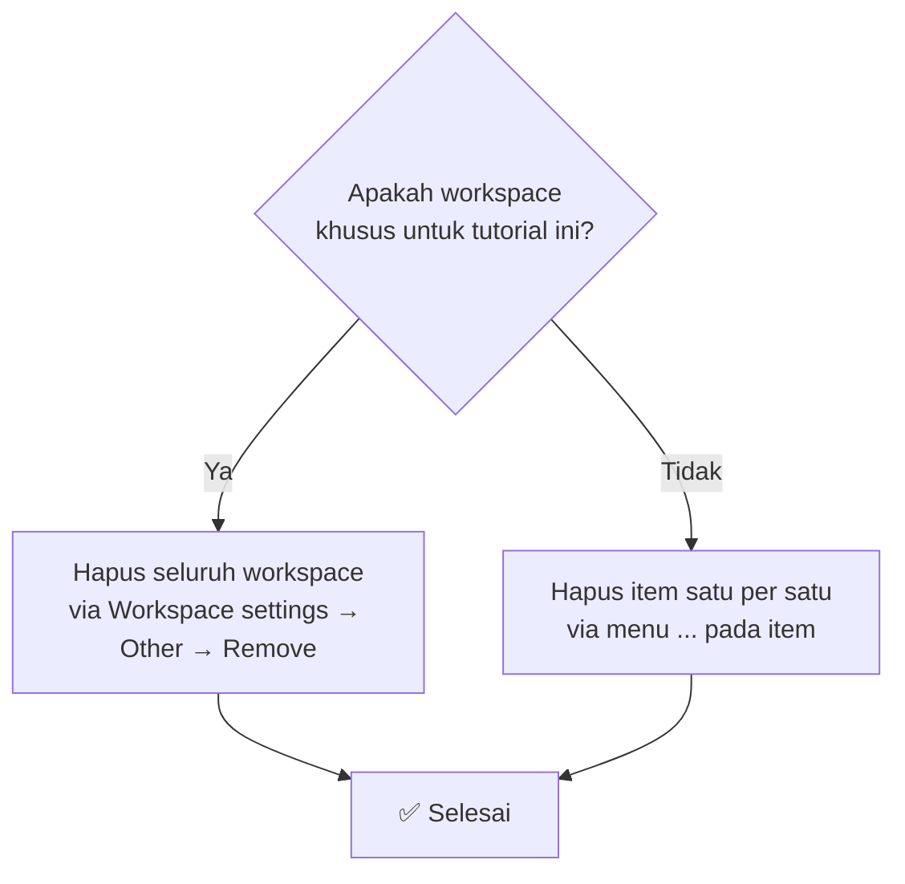

# Tutorial Lakehouse: Membersihkan resource Fabric

> 🇬🇧 English version: [7 - Clean up resources.md](7%20-%20Clean%20up%20resources.md)

Pada tutorial ini, Anda menghapus resource yang dibuat di tutorial sebelumnya untuk menghindari konsumsi kapasitas yang tidak perlu. Anda dapat menghapus item individual atau menghapus seluruh workspace.

## Pilihan pembersihan

## Menghapus item individual

Untuk membersihkan item tertentu tanpa menghapus seluruh workspace, buka workspace Anda dan hapus item yang tidak diperlukan lagi.

1. Pilih workspace Anda dari menu navigasi untuk membuka tampilan item workspace.
2. Pilih menu **...** (titik tiga) di sebelah item yang ingin Anda hapus, lalu pilih **Delete**.

Anda dapat menghapus item apa pun yang Anda buat di tutorial ini, termasuk:

- Lakehouse **wwilakehouse** (dan SQL analytics endpoint terkait)
- Semantic model yang Anda buat untuk pelaporan
- Notebook apa pun yang Anda gunakan untuk persiapan dan transformasi data
- Pipeline data yang Anda buat untuk ingest data

## Menghapus workspace

Jika Anda membuat workspace khusus untuk tutorial ini, Anda dapat menghapus seluruh workspace dan semua isinya sekaligus.

1. Pilih workspace Anda dari menu navigasi untuk membuka tampilan item workspace.

    

2. Pilih **Workspace settings**.

    

3. Pilih **Other** dan **Remove this workspace**.

    

4. Saat peringatan muncul, pilih **Delete**.

## Konten terkait

- [Pilihan untuk memuat data ke Fabric Lakehouse](https://learn.microsoft.com/id-id/fabric/data-engineering/load-data-lakehouse)

---

🎉 **Selamat!** Anda telah menyelesaikan seluruh rangkaian Workshop Data Engineering Fabric.
