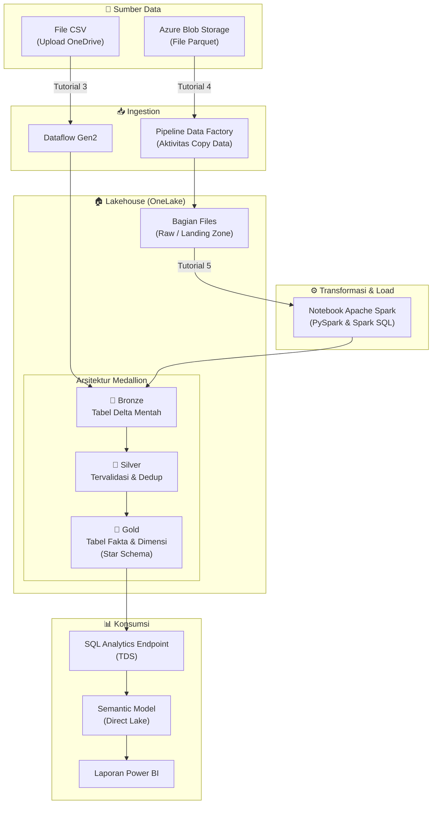
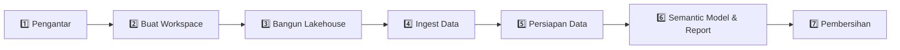
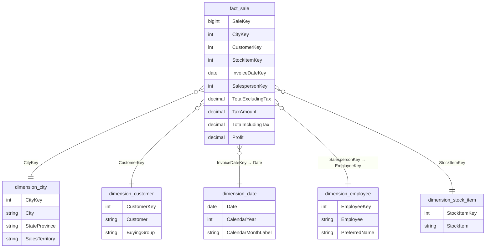

# Workshop Data Engineering Fabric (Bahasa Indonesia)

Workshop praktik langsung yang membahas tutorial **Microsoft Fabric Lakehouse** dari ujung ke ujung — mulai dari pembuatan workspace hingga pelaporan dan pembersihan resource.

> 🇬🇧 English version: [README.md](README.md)

## Ikhtisar

Repositori ini berisi panduan tutorial langkah demi langkah untuk membangun solusi lakehouse berskala enterprise menggunakan **Microsoft Fabric**. Tutorial ini menempuh seluruh siklus hidup data engineering menggunakan dataset sampel **Wide World Importers (WWI)** dengan mengikuti **arsitektur medallion** (Bronze → Silver → Gold).

Yang akan Anda pelajari:

- Membuat workspace dan lakehouse di Fabric
- Mengingest data menggunakan **Dataflow Gen2** dan **Pipeline Data Factory**
- Mentransformasi dan menyiapkan data dengan **notebook Apache Spark** (PySpark & Spark SQL)
- Membangun **tabel Delta Lake** dengan desain star schema (tabel fakta & dimensi)
- Membuat **semantic model** dengan mode Direct Lake
- Membangun **laporan Power BI** dari data lakehouse

## Arsitektur

## Alur Pembelajaran

## Daftar Tutorial

| # | File | Deskripsi |
|---|------|-----------|
| 1 | [Pengantar tutorial Lakehouse](1%20-%20Pengantar%20tutorial%20Lakehouse.id.md) | Ikhtisar skenario end-to-end, arsitektur, dataset sampel, dan model data |
| 2 | [Memulai](2%20-%20Memulai.id.md) | Membuat workspace Fabric dengan kapasitas trial |
| 3 | [Membangun lakehouse](3%20-%20Membangun%20lakehouse.id.md) | Membuat lakehouse, mengingest data CSV sampel via Dataflow Gen2, dan membangun laporan cepat |
| 4 | [Mengingest data](4%20-%20Mengingest%20data.id.md) | Menggunakan pipeline Data Factory dengan aktivitas Copy data untuk mengingest data WWI parquet dari Azure Blob Storage |
| 5 | [Menyiapkan data](5%20-%20Menyiapkan%20data.id.md) | Mentransformasi data mentah menjadi tabel Delta menggunakan notebook Spark (PySpark & Spark SQL), membuat tabel fakta/dimensi dan agregat bisnis |
| 6 | [Membuat semantic model dan membangun laporan](6%20-%20Membuat%20semantic%20model%20dan%20laporan.id.md) | Membuat semantic model Direct Lake, mendefinisikan relasi tabel, dan membangun laporan Power BI |
| 7 | [Membersihkan resource](7%20-%20Membersihkan%20resource.id.md) | Menghapus item individual atau menghapus seluruh workspace |

## Prasyarat

- Akun **Microsoft Fabric** ([trial gratis tersedia](https://learn.microsoft.com/id-id/fabric/fundamentals/fabric-trial))
- Lisensi **Power BI** (diperlukan untuk Fabric trial)
- **OneDrive** sudah dikonfigurasi (untuk upload file CSV pada Tutorial 3)
- Pemahaman dasar konsep data engineering

## Teknologi Utama

| Teknologi | Penggunaan |
|---|---|
| **Microsoft Fabric** | Platform analitik terpadu |
| **Lakehouse** | Penyimpanan data terpadu yang menggabungkan data lake dan warehouse |
| **Delta Lake** | Format tabel terbuka untuk transaksi ACID |
| **Apache Spark** | Transformasi data (PySpark & Spark SQL) |
| **Data Factory** | Orkestrasi pipeline dan ingest data |
| **Dataflow Gen2** | Transformasi data low-code |
| **Power BI** | Pelaporan dan visualisasi |
| **Direct Lake** | Mode query cepat yang membaca langsung dari OneLake |

## Dataset Sampel

Tutorial ini menggunakan database sampel **Wide World Importers (WWI)** — sebuah importir dan distributor barang novelty grosir. Model data mencakup:

- **Tabel fakta**: `fact_sale` — transaksi penjualan dengan kuantitas, harga, dan profit
- **Tabel dimensi**: `dimension_city`, `dimension_customer`, `dimension_date`, `dimension_employee`, `dimension_stock_item`
- **Tabel agregat**: `aggregate_sale_by_date_city`, `aggregate_sale_by_date_employee`

### Diagram Star Schema

## Referensi

- [Dokumentasi Microsoft Fabric](https://learn.microsoft.com/id-id/fabric/)
- [Tutorial Lakehouse di Microsoft Learn](https://learn.microsoft.com/id-id/fabric/data-engineering/tutorial-lakehouse-introduction)
- [Sampel Fabric di GitHub](https://github.com/microsoft/fabric-samples)
