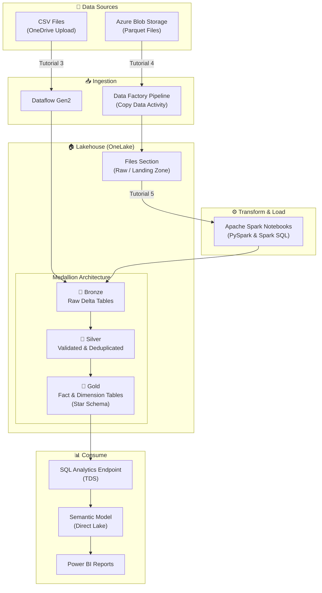

# Fabric Data Engineering Workshop

A hands-on workshop covering the **Microsoft Fabric Lakehouse** end-to-end tutorial — from workspace creation to reporting and clean-up.

## Overview

This repository contains step-by-step tutorial guides for building an enterprise-grade lakehouse solution using **Microsoft Fabric**. The tutorials walk through the complete data engineering lifecycle using the **Wide World Importers (WWI)** sample dataset, following the **medallion architecture** (Bronze → Silver → Gold).

You will learn how to:

- Create a Fabric workspace and lakehouse
- Ingest data using **Dataflow Gen2** and **Data Factory pipelines**
- Transform and prepare data with **Apache Spark notebooks** (PySpark & Spark SQL)
- Build **Delta Lake tables** with star schema design (fact & dimension tables)
- Create **semantic models** with Direct Lake mode
- Build **Power BI reports** from lakehouse data

## Architecture

## Tutorial Contents

| # | File | Description |
|---|------|-------------|
| 1 | [Lakehouse tutorial introduction](1%20-%20Lakehouse%20tutorial%20introduction.md) | Overview of the end-to-end scenario, architecture, sample dataset, and data model |
| 2 | [Get started](2%20-%20Get%20started.md) | Create a Fabric workspace with trial capacity |
| 3 | [Build a lakehouse](3%20-%20Build%20a%20lakehouse.md) | Create a lakehouse, ingest sample CSV data via Dataflow Gen2, and build a quick report |
| 4 | [Ingest data](4%20-%20Ingest%20data.md) | Use Data Factory pipeline with Copy data activity to ingest WWI parquet data from Azure Blob Storage |
| 5 | [Prepare data](5%20-%20Prepare%20data.md) | Transform raw data into Delta tables using Spark notebooks (PySpark & Spark SQL), create fact/dimension tables and business aggregates |
| 6 | [Create a semantic model and build a report](6%20-%20Create%20a%20semantic%20model%20and%20build%20a%20report.md) | Create a Direct Lake semantic model, define table relationships, and build Power BI reports |
| 7 | [Clean up resources](7%20-%20Clean%20up%20resources.md) | Delete individual items or remove the entire workspace |

## Prerequisites

- A **Microsoft Fabric** account ([free trial available](https://learn.microsoft.com/en-us/fabric/fundamentals/fabric-trial))
- A **Power BI** license (required for Fabric trial)
- **OneDrive** configured (for CSV file upload in Tutorial 3)
- Basic familiarity with data engineering concepts

## Key Technologies

| Technology | Usage |
|---|---|
| **Microsoft Fabric** | Unified analytics platform |
| **Lakehouse** | Unified data store combining data lake and warehouse |
| **Delta Lake** | Open table format for ACID transactions |
| **Apache Spark** | Data transformation (PySpark & Spark SQL) |
| **Data Factory** | Pipeline orchestration and data ingestion |
| **Dataflow Gen2** | Low-code data transformation |
| **Power BI** | Reporting and visualization |
| **Direct Lake** | Fast query mode reading directly from OneLake |

## Sample Dataset

The tutorials use the **Wide World Importers (WWI)** sample database — a wholesale novelty goods importer and distributor. The data model includes:

- **Fact table**: `fact_sale` — sales transactions with quantities, prices, and profit
- **Dimension tables**: `dimension_city`, `dimension_customer`, `dimension_date`, `dimension_employee`, `dimension_stock_item`
- **Aggregate tables**: `aggregate_sale_by_date_city`, `aggregate_sale_by_date_employee`

## References

- [Microsoft Fabric documentation](https://learn.microsoft.com/en-us/fabric/)
- [Lakehouse tutorial on Microsoft Learn](https://learn.microsoft.com/en-us/fabric/data-engineering/tutorial-lakehouse-introduction)
- [Fabric samples on GitHub](https://github.com/microsoft/fabric-samples)